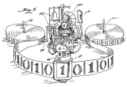

% Wszystko z funkcji
% Marcin Benke
% Dni Otwarte Kampusu Ochota, 18.04.2015

# 10101010

* ``wszyscy wiedzą'', że komputery to zera i jedynki
* znamy maszynę Turinga



... ale skąd się wzięła?

# Problem rozstrzygania (Das Entscheidungsproblem)


W XVII wieku konstruowano maszyny liczące (np. Leibniz).

Ale czy da się skonstruować ``maszynę myślącą''?

## Hilbert, 1928

> Czy istnieje algorytm, który potrafi rozstrzygać
> czy dana formuła logiczna jest prawdziwa? 

Żeby wykazać, że nie, trzeba skonstruować model obliczeń, który
obejmie wszelkie możliwe algorytmy.

# Modele obliczeń

## Turing: maszyna z nieskończoną taśmą i regułami działania

$\delta(q_0,0) = (q_0,1,R)$

$\delta(q_0,1) = (q_1,0,R)$

## Church: funkcje

$\lambda f.(\lambda x. f(x\,x) (\lambda x. f(x\,x)) $

# Funkcje


* $f(x) = x^2$
* $g(x) = x^2$
* funkcja f...funkcja g...funkcja $x^2$ 
* funkcja $ax^2$ ?
* jako funkcja x: $\lambda x.ax^2$
* jako funkcja a: $\lambda a.ax^2$

# Rachunek lambda
Tylko trzy konstrukcje: $\begin{array}{lcll}
M  & \to & x  \qquad &  \mbox{zmienna}\\ 
   & \mid & \lambda x.M \qquad & \mbox{definicja funkcji}\\
   & \mid & M_1(M_2) \qquad & \mbox{użycie funkcji}\\
\end{array}$

... i jedna reguła obliczenia: $(\lambda x.M)N \leadsto M[N/x]$

Pozwala obliczyć dokładnie to samo co maszyna Turinga.

# Funkcje wieloargumentowe

Funkcję $f(x,y)$ reprezentujemy jako funkcję $g$ argumentu $x$,
która daje w wyniku funkcję argumentu $y$ tak aby

$g(x)(y) = f(x,y)$

na przykład

$\lambda f \lambda x. f x$ --- zastosowanie funkcji do argumentu

$\lambda f\lambda g\lambda x. f (g x)$ --- złożenie funkcji $f$ i $g$

Tekstowo $\lambda$ zapisujemy jako `\`, np. `\x.x`

# Kodowanie
\relax
Chcemy mieć true, false, if tak, żeby

* $if\ true\ tak\ nie \leadsto tak$
* $if\ false\ tak\ nie \leadsto nie$

. . .

```
true = \x y. x
false = \x y. y

true x y = x
false x y = y
```

. . .

	
```
if b t e = b t e
```

# Kalkulator

## http://benke.org/doko

# Ćwiczenie 1
\relax
Zdefiniuj not tak, żeby

```
not true = false
not false = true
```

. . .

```
not = \b. b false true
```

# Ćwiczenie 2: pary
\relax

```
fst (pair x y) = x
snd (pair x y) = y
```

. . .
```
pair = \x\y\z.z x y
fst = \p.p true
snd = \p.p false
```

# Liczby naturalne
\relax
Pomysł:

$n\ f\ x = f^{\,n}(x)$

. . .

`zero = \f x.x`

`one = \f x.f x`

`two = \f x.f(f x)`

Jak zdefiniować funkcję następnika: `succ x = x+1` ?

. . .

$succ: f^{\,n}(x) \mapsto f(f^{\,n}(x)) $

. . .

`succ = \n f x. f(n f x)` 

# Ćwiczenie 3 - arytmetyka
\relax

## Dodawanie
```
succ two l o = l(l(l o))
add three two l o = l(l(l(l(l o))))
```

. . .

```
add m n = m succ n
add = \m\n\f\x.m f (m f (n f x))
```

## Mnożenie

Idea:

$(f^n)^m(x) = f^{m*n}(x)$

```
mul three two = l(l(l(l(l(l o)))))
```

. . .

```
mul = \m\n\f.m(n f)
```


# Prosta rekurencja
\relax

$f(0) = c$

$f(n+1) = h(n,f(n))$

Stworzymy ciąg par $(0,a_0),(1,a_1),...,(n,a_n)$ taki, że

$a_0 = c;\ a_{i+1} = h(a_i);\ f(n) = snd(a_n)$

`init = pair zero c`

`step = \p. pair (succ(fst p)) (h p)`

`f = \n. snd(n step init)`

# Poprzednik

$pred(0) = 0$

$pred(n+1) = h(n, f(n))$

$h\,(x, y) = x$

. . .

```
init = pair zero zero
step = \x. pair (succ (fst x)) (fst x)
pred = \n. snd (n step init)
```

## Odejmowanie

sub n m = m pred n

# Listy
\relax

```
nil = pair true true
isnil = fst
cons h t = pair false (pair h t)
```

**Ćwiczenie:** napisz funkcje dające głowę i ogon listy

. . .

```
head = \z.fst(snd z)
tail = \z.snd(snd z)
```


# Dodatki
\relax


## Potęgowanie
```
exp m n = \f\x.(n m) f x
```
albo krócej
```
exp = \m n. n m
```

## Listy inaczej

```
nil = false
cons = pair
head = fst
```

# Podstawienie

$(\lambda x.M)N \leadsto M[N/x]$

$M[N/x]$ oznacza ``M z N wstawionym zamiast x''

$x[N/x] = N$

$y[N/x] = y$ (gdy $x\neq y$)

$(M_1(M_2))[N/x] = M_1[N/x]$

$(\lambda y.M)[N/x] = \lambda y.(M[N/x])$ (gdy y nie występuje w N).

# Technikalia

Zakładamy, że wszystkie zmienne mają różne nazwy

Możemy to zawsze zapewnic odpowiednio zmnieniając nazwy:

$\lambda y.M$ jest równowazne $\lambda z.M[z/y]$ 


Tekstowo piszemy `\x.M` zamiast $\lambda x.M$

opuszczamy nawiasy tam gdzie niepotrzebne, MNP oznacza (MN)P
